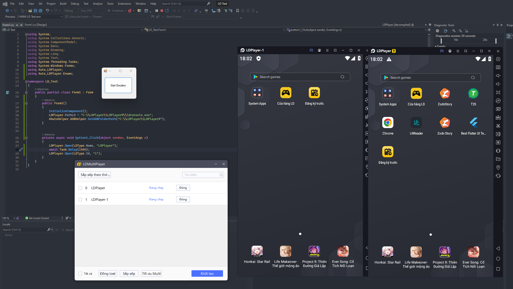

# AutoLDPlayer

AutoLDPlayer Includes:

-   KAutoHelpper
-   Emgu.CV.World.dll
-   Auto_LDPlayer.dll

# Demo



# Nuget

### Nuget: https://www.nuget.org/packages/Auto_LDPlayer

```js
PM> Install-Package Auto_LDPlayer
```

# Fix error: Couldn't install package

```
For the new Emgu Nuget package you do need to use PackageReference instead of the traditional package.config.

- Uninstall all NuGet Packages [This removes the package.config file]
- Go to Tools --> Options --> NuGet Package Manager --> General
- Change the default package management format to "PackageReference"
- Check "allow format selection on first package install"
- Click OK
- Install Emgu.CV, Emgu.CV.Bitmap, Emgu.CV.UI and Emgu.CV.runtime.windows
- These Emgu packages should now appear under your references and you should not see a package.config file.
```

# List Command

```js
Note:
param => name, index. nameOrId => "Name LDPlayer Or Index LDPlayer"
deviceID get form cmd "adb devices" or used void "GetDevices2_Running()" return the variable "adb_id"
```

1. **Set Path LDPlayer "ldconsole.exe"**

```js
LDPlayer.pathLD = "Your Path ldconsole.exe"; //VD: "C:\LDPlayer\LDPlayer4.0\ldconsole.exe"
//Set ADB Your Path
KAutoHelper.ADBHelper.SetADBFolderPath(@"C:\LDPlayer\LDPlayer4.0");
```

2. **Initialization**

```js
using Auto_LDPlayer;
using Auto_LDPlayer.Enums;
```

3. **Example**

```js
LDPlayer.Open(LDType.Name, "ld0")
LDPlayer.Open(LDType.Id, "0")
```

4. **Manipulation Emulator**

```js
void Open(LDType ldType, string nameOrId)

void OpenApp(LDType ldType, string nameOrId, string packageName) //Mở LD cùng app khi chạy

void Close(LDType ldType, string nameOrId)

void CloseAll()

void ReBoot(LDType ldType, string nameOrId)
```

5. **Custom Emulator**

```js
void Create(string name)

void Copy(string name, string fromNameOrId)

void Delete(LDType ldType, string nameOrId)

void Rename(LDType ldType, string nameOrId, string titleNew)
```

6. **App**

```js
void InstallAppFile(LDType ldType, string nameOrId, string fileName) //fileName trỏ tới file apk

void InstallAppPackage(LDType ldType, string nameOrId, string packageName) //Cài qua LD Store, hơi dỏm, tốt nhất tự cài apk

void UninstallApp(LDType ldType, string nameOrId, string packageName)

void RunApp(LDType ldType, string nameOrId, string packageName)

void KillApp(LDType ldType, string nameOrId, string packageName)
```

7. **Other**

```js
void Locate(LDType ldType, string nameOrId, string Lng, string Lat) //Set Toạ Độ GPS
```

```js
void ChangeProperty(LDType ldType, string nameOrId, string cmd)
    cmd use:
    [--resolution ]
    [--cpu < 1 | 2 | 3 | 4 >]
    [--memory < 512 | 1024 | 2048 | 4096 | 8192 >]
    [--manufacturer asus]
    [--model ASUS_Z00DUO]
    [--pnumber 13812345678]
    [--imei ]
    [--imsi ]
    [--simserial ]
    [--androidid ]
    [--mac ]
    [--autorotate < 1 | 0 >]
    [--lockwindow < 1 | 0 >]

    Exam:   LDPlayer.Change_Property("name", "ld0", " --cpu 1 --memory 1024 --imei 123456789");
```

```js
void SetProp(LDType ldType, string nameOrId, string key, string value)

string GetProp(LDType ldType, string nameOrId, string key)

string ADB(LDType ldType, string nameOrId, string cmd)

void DownCPU(LDType ldType, string nameOrId, string rate)

void Backup(LDType ldType, string nameOrId, string filePath)

void Restore(LDType ldType, string nameOrId, string filePath)

void Action(LDType ldType, string nameOrId, string key, string value)

void Scan(LDType ldType, string nameOrId, string filePath)

void SortWnd() //Sắp Xếp Tab Giả Lập

void zoomIn(LDType ldType, string nameOrId) //Phóng to

void zoomOut(LDType ldType, string nameOrId) //Phóng nhỏ lại

void Pull(LDType ldType, string nameOrId, string remoteFilePath, string localFilePath)

void Push(LDType ldType, string nameOrId, string remoteFilePath, string localFilePath)

void BackupApp(LDType ldType, string nameOrId, string packageName, string filePath)

void RestoreApp(LDType ldType, string nameOrId, string packageName, string filePath)
```

```js
void GlobalConfig(LDType ldType, string nameOrId, string fps, string audio, string fastPlay, string cleanMode)
    [--fps <0~60>] [--audio <1 | 0>] [--fastplay <1 | 0>] [--cleanmode <1 | 0>]
    Exam: LDPlayer.Golabal_Config("name", "ld0", "60", "0", "0", "0");
```

8. **Get List Devices**

```js
List<string> GetDevices()

List<string> GetDevicesRunning()

bool IsDeviceRunning(LDType ldType, string nameOrId)

List<LDevice> GetDevices2()

List<LDevice> GetDevices2Running()
```

9. **Cmd**

```js
void ExecuteLD(string cmd)

string ExecuteLDResult(string cmdCommand)
```

10. **Directional**

```js
void Back(string deviceID)

void Home(string deviceID)

void Menu(string deviceID)
```

11. **Tap with OpenCV**

```js
void TapImg(string deviceID, Bitmap imgFind)
```

12. **Change Proxy**

```js
void ChangeProxy(string deviceID, string ipProxy, string portProxy)

void RemoveProxy(string deviceID)
```

# AutoLDPlayer Java

A Java port of the AutoLDPlayer library for automating LDPlayer Android emulator instances.

## Features

- Control LDPlayer instances (create, start, stop, reboot)
- Install and manage Android apps
- Device control and automation
- System property management
- File operations
- Device settings configuration

## Requirements

- Java 11 or higher
- LDPlayer 4.0 or higher
- Maven for building

## Installation

Add the following dependency to your `pom.xml`:

```xml
<dependency>
    <groupId>com.ldplayer</groupId>
    <artifactId>auto-ldplayer</artifactId>
    <version>1.0-SNAPSHOT</version>
</dependency>
```

## Usage

First, set the path to your LDPlayer installation:

```java
LDPlayer.setPathLD("C:\\LDPlayer\\LDPlayer4.0\\ldconsole.exe");
```

### Basic Operations

```java
// Open an emulator instance
LDPlayer.open(LDType.NAME, "ld0");

// Launch an app
LDPlayer.openApp(LDType.NAME, "ld0", "com.example.app");

// Close an emulator
LDPlayer.close(LDType.NAME, "ld0");

// Close all emulators
LDPlayer.closeAll();
```

### Managing Emulator Instances

```java
// Create a new instance
LDPlayer.create("MyEmulator");

// Copy an existing instance
LDPlayer.copy("NewEmulator", "ld0");

// Delete an instance
LDPlayer.delete(LDType.NAME, "MyEmulator");

// Rename an instance
LDPlayer.rename(LDType.NAME, "ld0", "NewName");
```

### App Management

```java
// Install an APK file
LDPlayer.installAppFile(LDType.NAME, "ld0", "path/to/app.apk");

// Install from package name (via LD Store)
LDPlayer.installAppPackage(LDType.NAME, "ld0", "com.example.app");

// Uninstall an app
LDPlayer.uninstallApp(LDType.NAME, "ld0", "com.example.app");

// Run an app
LDPlayer.runApp(LDType.NAME, "ld0", "com.example.app");

// Kill an app
LDPlayer.killApp(LDType.NAME, "ld0", "com.example.app");
```

### Device Configuration

```java
// Set GPS location
LDPlayer.locate(LDType.NAME, "ld0", "longitude", "latitude");

// Change device properties
LDPlayer.changeProperty(LDType.NAME, "ld0", "--cpu 2 --memory 2048");

// Set a system property
LDPlayer.setProp(LDType.NAME, "ld0", "key", "value");

// Get a system property
String value = LDPlayer.getProp(LDType.NAME, "ld0", "key");
```

### Device Management

```java
// Get all devices
List<String> devices = LDPlayer.getDevices();

// Get running devices
List<String> runningDevices = LDPlayer.getDevicesRunning();

// Check if a device is running
boolean isRunning = LDPlayer.isDeviceRunning(LDType.NAME, "ld0");
```

## Contributing

Contributions are welcome! Please feel free to submit a Pull Request.

## License

This project is licensed under the MIT License - see the LICENSE file for details.
